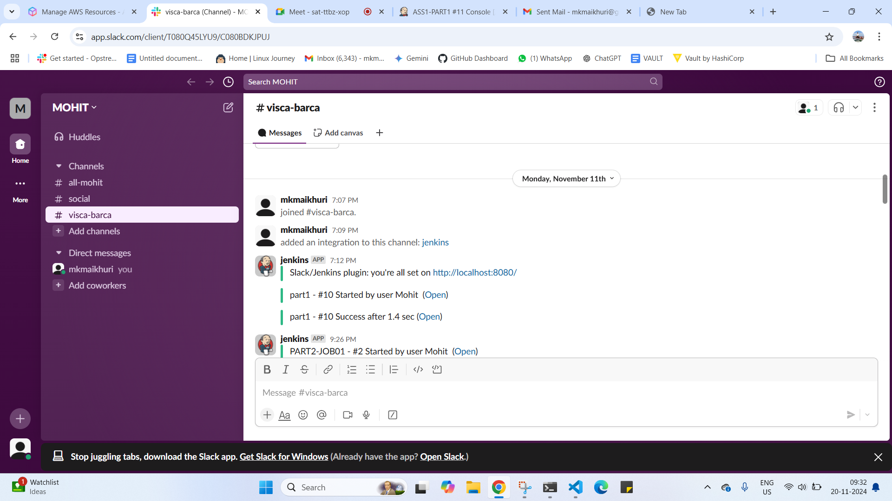
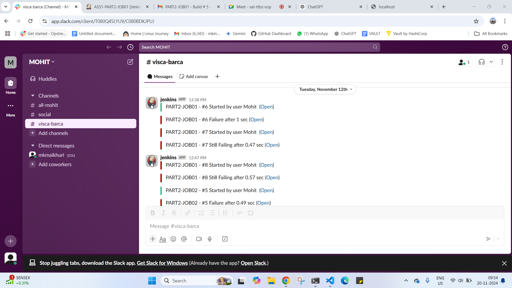

Part 1:-

Create a Jenkins job via which you will be able to perform the below operations & if any of the steps fail a Slack and Email notification should be sent:
Create a branch
List all branches
Merge one branch with another branch
Rebase one branch with another branch
Delete a branch

Part 2:-

Create a Jenkins job that takes input parameter string <Ninja Name> and it should - 
Create a file 
Add content in the file "<Ninja Name> from DevOps Ninja"
      	
Create another Jenkins job that should - 
Publish the file content created in job 1 using a web server
      
Configurations should be such that - 
The second job must be triggered automatically only after completing the first job successfully.
If any steps fail, a Slack and Email notification should be sent.
If all jobs run successfully, Slack and Email notifications should be sent.

Overiew of jenkins dashboard 

PART1

CONSOLE PART

NOTIFICATION PART

Mail

     ---pass
     ---fail

slack

PART2 JOB1

   --- USED UPSTEREAM AND DOWNSTREAM HERE TO RUN JOB 2 ALSO 

COSNOLE PART

NOTIFICATION PART

MAIL ----> 
SLACK ---->  

PART2 JOB2

  ----HERE USED JOB 2 AS DONWSTREAM

CONSOLE PART

PUBLISH THE MESSAGE 

NOTIFICATION PART 

MAIL ---> ---PASS
           ---FAIL

SLACK ---->  

Slack notification:-
https://youtu.be/58YRWes7iaM?si=zBCGUQ5OyPM72Pm-

MAIL --https://www.youtube.com/watch?v=F01HOaklPeM&amp;t=325s