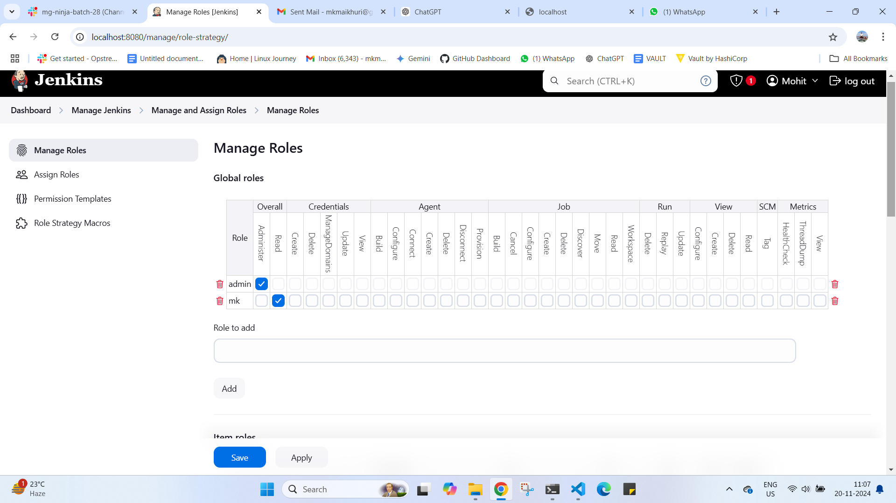

Assignment -02

Topics Covered:  (User Authentication, User Authorization)

Part 1
There is an organization which has 3 teams based on user roles : 
            - Developer
            - DevOps
            - Testing
        
First, you need to create 9 Jenkins jobs. Each job will print its job name, and build number.
            For the Developer, create 3 dummy jobs, visible in the developer view
                job1:- dev-1
                job2:- dev-2
                job3:- dev-3
            For Testing, create 3 dummy jobs, visible in the testing view
                job1:- test-1
                job2:- test-2
                job3:- test-3
            For DevOps, create 3 dummy jobs, visible in the devops view
                job1:- devops-1
                job2:- devops-2
                job3:- devops-3

Users in each team: 
            developer: [ They can see only dev jobs, can build it, see workspace and configure it ]
                - developer-1 
                - developer-2 
            testing: [ They can see all test jobs, can build it, see workspace and can configure it, | They can also view dev jobs ]
                - testing-1 
                - testing-2 
            devops:  [ They can see all devops jobs, can build it, see workspace and can configure it, | They can also view dev and test jobs  ]
                - devops-1 
                - devops-2
            Administration
                -  admin-1 [ It will have full access ]        

See what Authorization strategy suits it and implement it.
Also, go through all authorization strategies.

Legacy mode
Project Based
Matrix Based
Role-Based

Part 2
Enable SSO with Google for admin user

PART 1 
CREATING JOBS IN THEIR VIEW

Dev view ----->  
Devops view ---> 
Test view ----> 

ALL DEV EXECUTE SHELL ----> 
ALL DEVOPS EXECUTE SHELL --> 
ALL TEST ECECUTE SHELL ----> 

CONSOLE PART 
DEV VIEW ---> 
DEVOPS VIEW ----> 
TEST VIEW --->  

USERS IN EACH TEAM 

USING ROLE BASED STATEGY TO GIVE ACCES TO PARTICULAR USER AND ALL

MANAGE ROLES 

ASSIGN ROLES 

TO CHECK LOGGING IN EACH USER AND CHECK 

developer-1 , 2 
[ They can see only dev jobs, can build it, see workspace and configure it ]
 
we can see developer view here

testing -1 ,2
[ They can see all test jobs, can build it, see workspace and can configure it, | They can also view dev jobs ]

can see and do everything in test view ----> 
only can see dev view --->

devops -1,2
[ They can see all devops jobs, can build it, see workspace and can configure it, | They can also view dev and test jobs  ]

can see and do everything in devops view ---->
only can see dev view ---> 
only can see test view ---> 

ADMIN-1 HHAVING FULL ACCESS 
like it will have all access for devops , test, and developer view with all thing 

PART 2  SSO ADMIN 

AS IAM CURRENTLY DOING IN LOCALHOST SO I HAVE CREATED NEW JENKINS INSTANCE HAVE GIVEN ITS URL IN IT 
 
JENKINS INSTANCE ---->  

CREATED LOAD BALANCER TO SET UP DNS NAME 

CONFIGURE IT IN USING GOOGLE DEV CONSOLE WITH OUR GMAIL 

IN JENKINS INSTALL THE GOOGLE PLUIGN AND SET UP IT 

LOGGING IN JENKINS USING THE URL SET USING GOOGGLE SSO 

GGOGLE SSO REFERENCE 
https://opstree.com/blog/2023/05/09/how-to-setup-sso-in-jenkins/