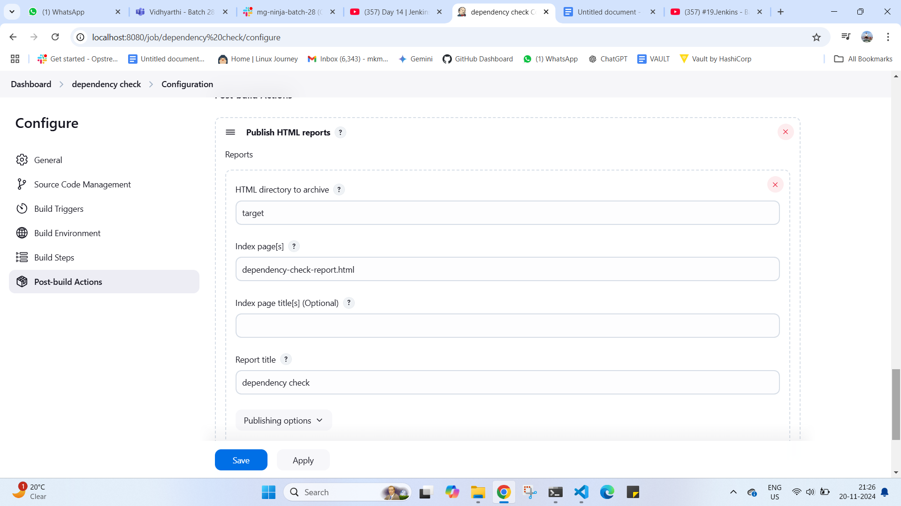

Perform CI checks on three Repositories using Jenkins, store reports, manage artifacts, and set up failure notifications.
API Repositories:
- Python:- https://github.com/OT-MICROSERVICES/attendance-api
- GoLang:- https://github.com/OT-MICROSERVICES/employee-api
- Java:- https://github.com/opstree/spring3hibernate.git
Jenkins Freestyle Jobs:
Create separate jobs for each check.
Configure to pull repositories from GitHub.
Implement Generic & Advance CI Checks (eg: Credential Scanning, Unit Testing, Code Coverage, Dependency, etc.)
Store and access reports within Jenkins.
Choose local or remote storage for artifacts.
Configure email, Slack, or Telegram notifications on CI check failures.

HERE I HAVE USED 
JAVA 
THE REPO USED HERE IS 
https://github.com/builderHub/CICD-01.git  AS https://github.com/opstree/spring3hibernate.git HAVING SOME ISSUES

 Dashboard  ON CI CHECK ONE EACH JOB 

1) credentiall scanning  job

2) unit testing  job

 ----> for archinig the jar file and also getting the unit test report

console part

report --> 

3) code coverge  job 

console part

jacoco coverage report - 

4) Dependency check  job / i can use this command also dependency-check --scan . --format HTML --out dependency-check-reports/
inside invoke depedency 

 
 

console part 

dependecy report 

slack notification on failure of each check 

