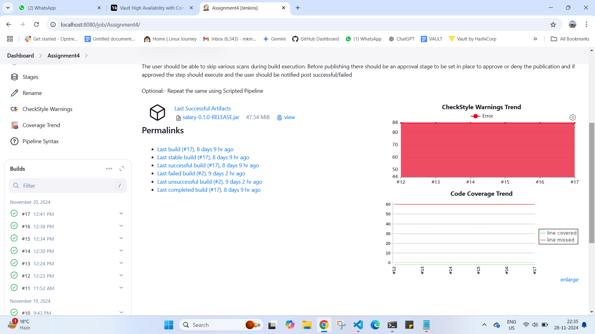

Assignment 4:

Create a Declarative CI  pipeline for java based project that contains various stages like
Code checkout
Run the below stages in parallel
Code stability.
Code quality analysis.
Code coverage analysis.
Generate a report for code quality & analysis.
Publish artifacts.
Send Slack and Email notifications.

The user should be able to skip various scans during build execution. Before publishing there should be an approval stage to be set in place to approve or deny the publication and if approved the step should execute and the user should be notified post successful/failed

Optional:- Repeat the same using Scripted Pipeline

REPO USED - https://github.com/builderHub/CICD-01.git

pipeline code 

pipeline {
    agent any

    parameters {
        booleanParam(name: 'stabilityScan', defaultValue: false, description: 'Skip Code Stability Scan?')
        booleanParam(name: 'qualityScan', defaultValue: false, description: 'Skip Code Quality Scan?')
        booleanParam(name: 'coverageScan', defaultValue: false, description: 'Skip Code Coverage Scan?')
        //booleanParam(name: 'approvePublish', defaultValue: false, description: 'Approve artifact publishing?')
    }

    stages {
        stage('Code Checkout') {
            steps {
                git branch: 'main', url: 'https://github.com/builderHub/CICD-01.git'
            }
        }

        stage('Initial Approval') {
            steps {
                input message: 'Do you want to proceed with the build?', ok: 'Yes'
            }
        }

        stage('Run Scans in Parallel') {
            parallel {
                stage('Code Stability') {
                    when {
                        expression { params.stabilityScan == true }
                    }
                    steps {
                        echo 'Running code stability analysis...'
                        sh 'mvn verify'
                        echo 'Code stability analysis completed.'
                    }
                }

                stage('Code Quality Analysis') {
                    when {
                        expression { params.qualityScan == true }
                    }
                    steps {
                        echo 'Running code quality analysis...'
                        sh 'mvn checkstyle:checkstyle'
                        echo 'Code quality analysis completed.'
                    }
                }

                stage('Code Coverage Analysis') {
                    when {
                        expression { params.coverageScan == true }
                    }
                    steps {
                        echo 'Running code coverage analysis...'
                        sh 'mvn jacoco:report'
                        echo 'Code coverage analysis completed.'
                    }
                }
            }
        }

        stage('Generate Report for Code Quality and Coverage') {
            steps {
                echo 'Generating code quality & coverage report...'
                recordIssues sourceCodeRetention: 'LAST_BUILD', tools: [checkStyle()]
                jacoco()
                echo 'Report generated successfully.'
            }
        }

        stage('Approval for Publishing Artifacts') {
            steps {
                input message: 'Do you want to approve the publication of artifacts?', ok: 'Approve'
            }
        }

        stage('Publish Artifacts') {
            steps {
                echo 'Publishing artifacts...'
                archiveArtifacts artifacts: 'target/*.jar'
                echo 'Artifacts published successfully.'
            }
        }
    }

     post {
        always {
            slackSend channel: 'visca-barca', message: 'Successfully done everything'
        }
    }
}

Configure example 

coverage trend report

checkstyle report

option to skip or not  ihave not slected anything so it will skip it 

asking to proceed forward

asking to publish the report or not

skioped all test cases output for that 

not skipping anything 

output 

console output

slack messge 
