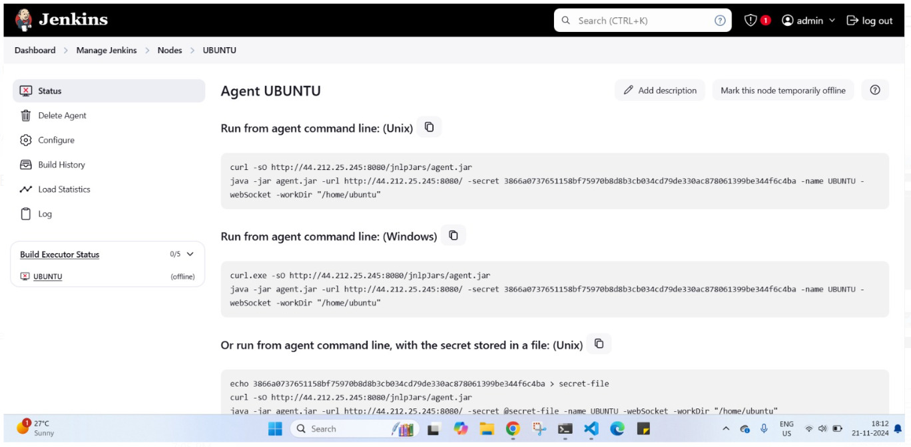
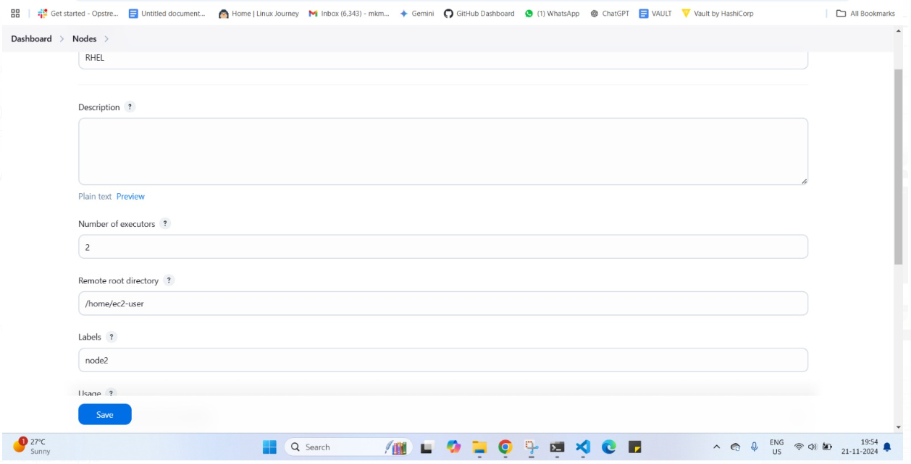

Assignment 05
Topics Covered:  (Configuring Agents, Distributing Loads, Executors, Assigning Nodes)
 
1] Configure an Ubuntu node using the execution of a command on the master method. 
         - Make sure at any point in time, a maximum of 5 jobs can be executed on this node.
         - Assign this node to Assignment 1: Part1

2] Configure a RHEL node using  Launch slave agents via SSH method. 
         - Make sure at any point of time a maximum of 2 jobs can be executed on this node.
         - Assign this node to Assignment 1: Part2 

video 
https://www.youtube.com/watch?v=Se7JtzFVZGE

STEP1 
Configuring using In Jenkins, you can launch a job in two main ways: via JNLP (Java Web Start) or SSH. Both methods require certain prerequisites to be met.

1. Using JNLP (Java Network Launch Protocol)

java is requried on slave node 

CONSOLE OUTPUT

2) USING SSH AGENT 

MADE REDHAT USER AND THEN COPY ITS PUBLIC IP IN ITS OWN AUTHORIZED KEYS SECTION TO GET IT SSH

