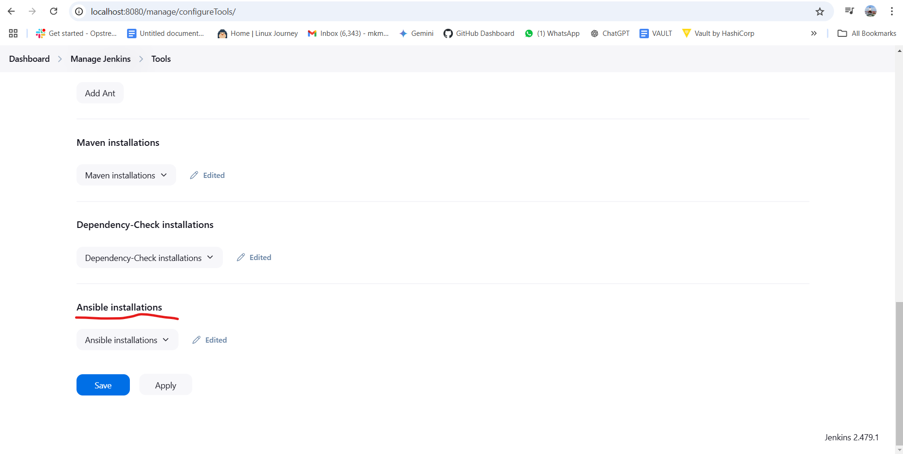
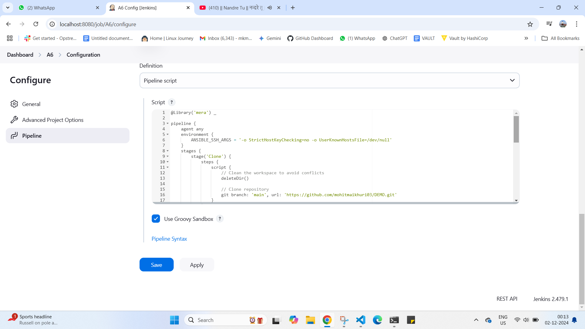
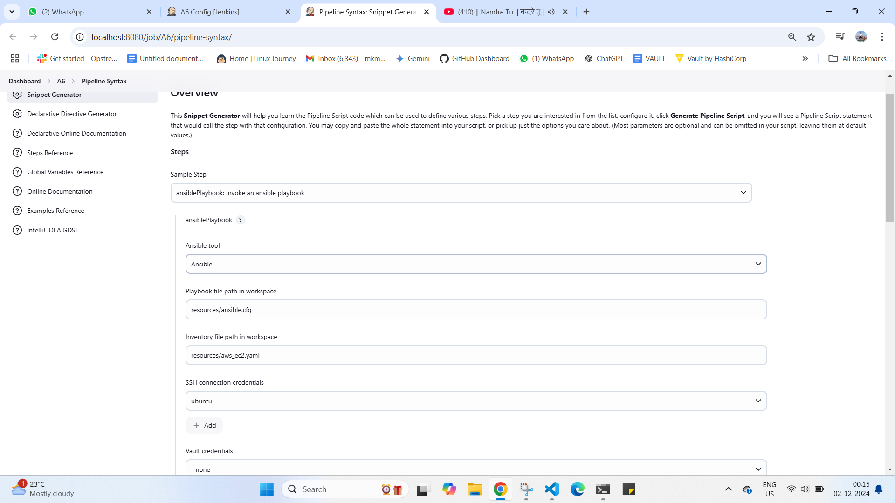
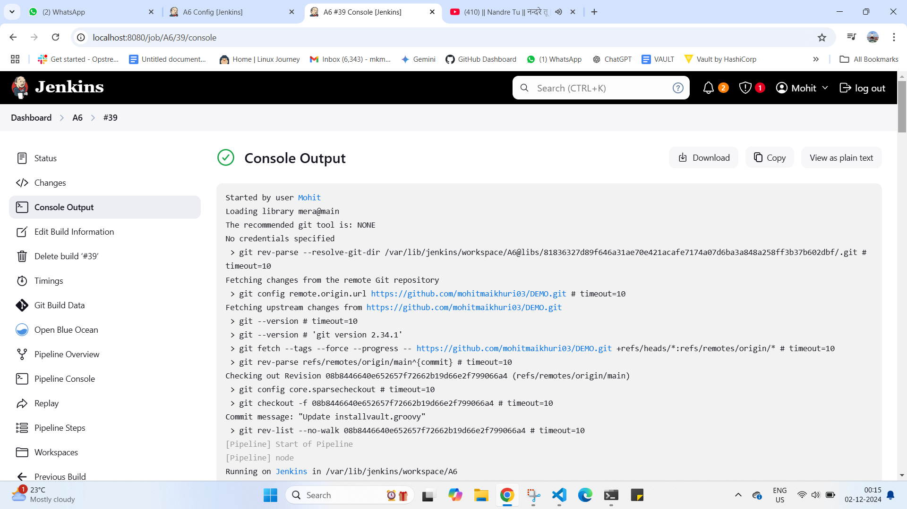
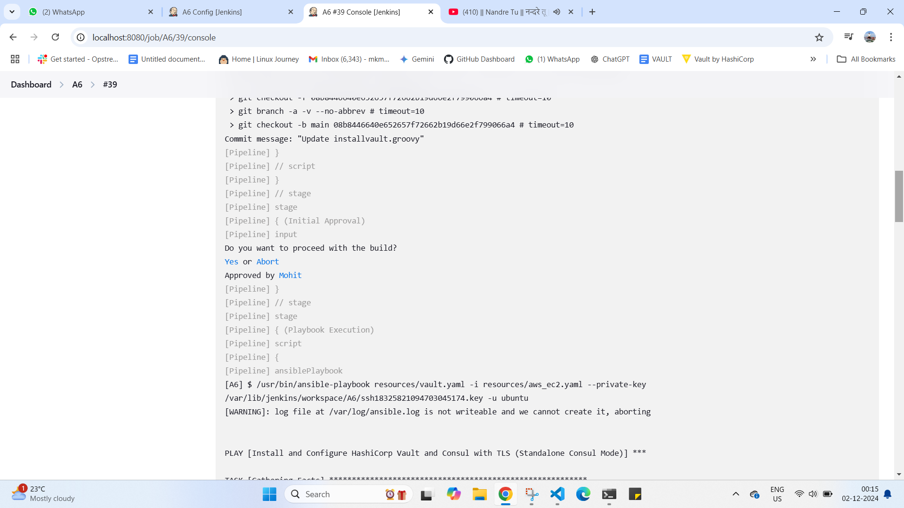
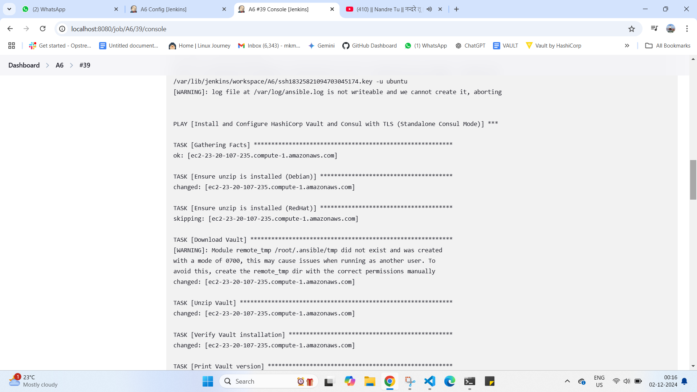
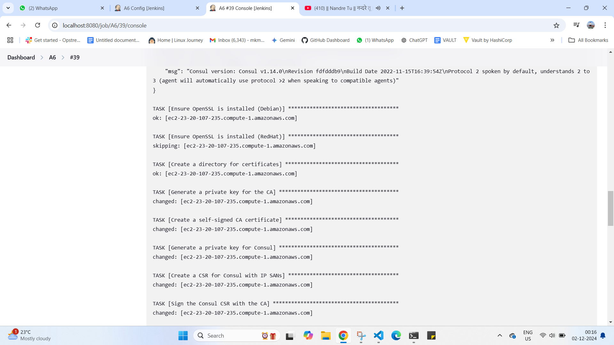
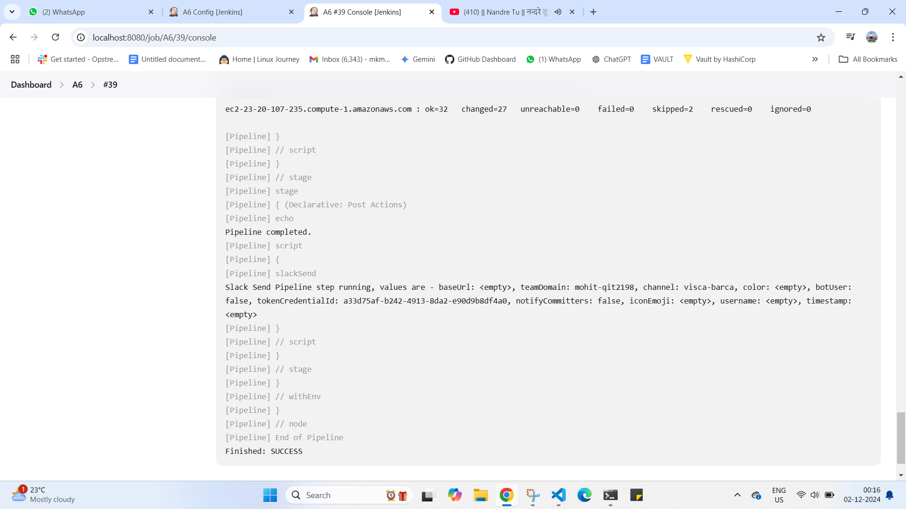
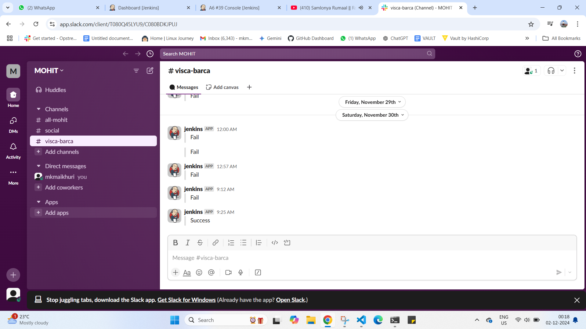

Create an ansible shared library in jenkins for your tool with the following steps:
- clone
- User Approval
- Playbook Execution
- Notification
Required inputs for the shared library should be passed via a configuration file

1) first download the ansible plugin and confgiure its parti n tolls section give the path such as /usr/bin
2) here we nedd to take our repo there we neeed to keep our yaml file in  which code is written and we need to use dynamic inventory here
3) because we cnat use oir priate key in our main repo any one can use it thats why use dynamicn concept 

$)we have given iti n resource file then we have called it uisng our ansible syntax whihc we took from our jenkns pipeline
there we get credetiulas id there we give part oof our playbook and iventory fie and that function we cna call in our main vars file
and from there we call in our pipleline

GIT REPO ----->>> https://github.com/mohitmaikhuri03/DEMO.git

PIPELINE CODE 

@Library('mera') _

pipeline {
    agent any
    environment {
        ANSIBLE_SSH_ARGS = '-o StrictHostKeyChecking=no -o UserKnownHostsFile=/dev/null'
    }
    stages {
        stage('Clone') {
            steps {
                script {
                    // Clean the workspace to avoid conflicts
                    deleteDir()
                    
                    // Clone repository
                    git branch: 'main', url: 'https://github.com/mohitmaikhuri03/DEMO.git'
                }
            }
        }
        stage('Initial Approval') {
            steps {
                input message: 'Do you want to proceed with the build?', ok: 'Yes', parameters: []
                // The pipeline will pause here, awaiting user approval to proceed.
            }
        }
        stage('Playbook Execution') {
            steps {
                script {
                    // Calls the MongoDB pipeline function from the shared library
                    installvault()
                }
            }
        }
    }
    post {
        success {
            script {
                notification('SUCCESS', '#visca-barca')
            }
        }
        failure {
            script {
                notification('FAILURE', '#visca-barca')
            }
        }
        always {
            echo 'Pipeline completed.'
        }
    }

}

SCRRENSHOTS

slack 

