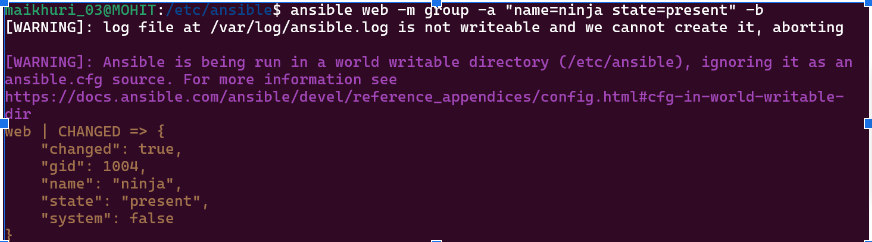
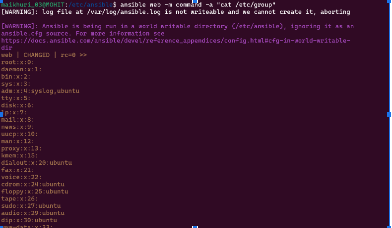

Assignment1-
Complete the following steps with the help of ansible modules:
UserManager:
Add NinjaTeam (Simulate Group) ex: team1
Add a User (Simulate) under a team ex: Nitish added to team1 Ensure below constraints are met:
A user should have read,write, execute access to home directory
All the users of same team should have read and excute access to home directory of fellow team members.
In home directory of every user there should be 2 shared directories
Team: Same team members will have full access
Ninja: All ninja's will have full access
Additional Features:
Change user Shell
Change user password
Delete user
Delete Group
List user or Team

1) ansible web -m group -a "name=team1 state=present" -b

2) ansible web -m group -a "name=ninja state=present" -b

3) ansible web -m user -a "name=Nitish state=present groups=team1" -b

4) ansible web -m file -a "path=/home/Nitish mode=0754 group=team1" -b

5) ansible web -m file -a "path=/home/Nitish/Team owner=Nitish group=team1 mode=0774 state=directory" -b

6) ansible web -m file -a "path=/home/Nitish/Ninja owner=Nitish group=ninja mode=0777 state=directory" -b

 
7) ansible web -m user -a "name=Nitish state=present group=team1 shell=/bin/zsh" -b
 

8) ansible web -m user -a "name=Nitish state=present group=team1 password='{{ \"mohit03\" | password_hash('sha512') }}'" -b

9) ansible web -m user -a "name=Nitish state=absent remove=yes" -b

10) ansible web -m group -a "name=team1 state=absent" -b
 

11) ansible web -m command -a "cat /etc/group"

12) ansible web -m shell -a "cat /etc/passwd"
