# Create group
ansible web -m group -a "name=team1 state=present" -b
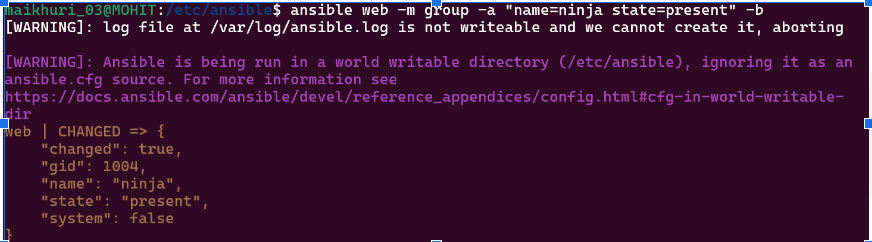

ansible web -m group -a "name=ninja state=present" -b
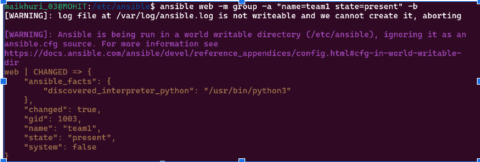
# Create user
ansible web -m user -a "name=Nitish state=present groups=team1" -b
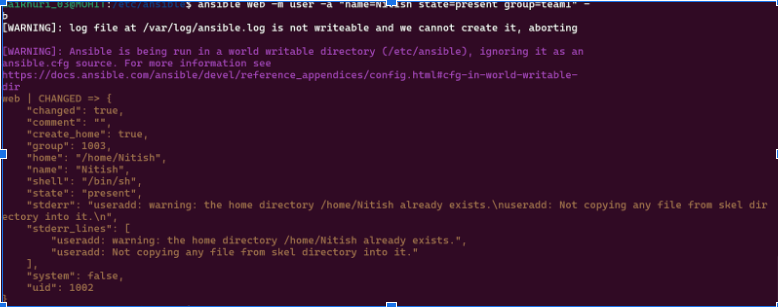
# Change user directory permission 
ansible web -m file -a "path=/home/Nitish mode=0754 group=team1" -b
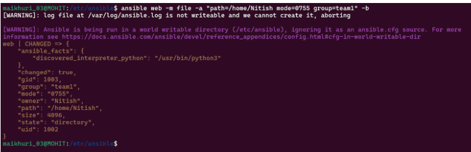

# User should have 2 directories with permissions
ansible web -m file -a "path=/home/Nitish/Team owner=Nitish group=team1 mode=0774 state=directory" -b
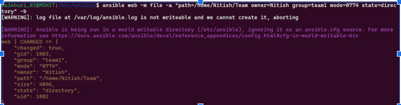
ansible web -m file -a "path=/home/Nitish/Ninja owner=Nitish group=ninja mode=0777 state=directory" -b
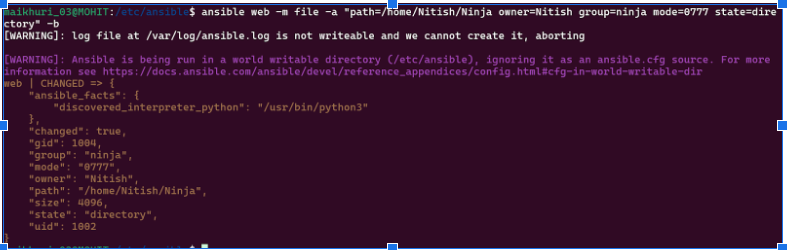

# Change user shell
ansible web -m user -a "name=Nitish state=present group=team1 shell=/bin/zsh" -b
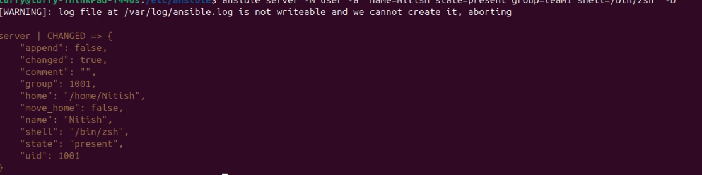
# Change password
ansible web -m user -a "name=Nitish state=present group=team1 password='{{ \"mohit03\" | password_hash('sha512') }}'" -b
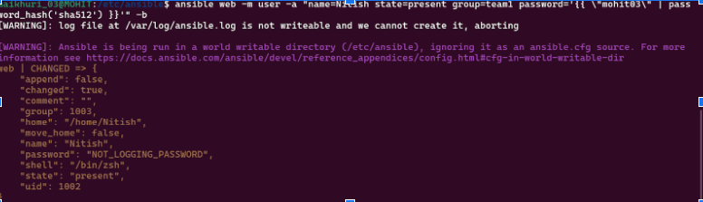
# Delete user
ansible web -m user -a "name=Nitish state=absent remove=yes" -b
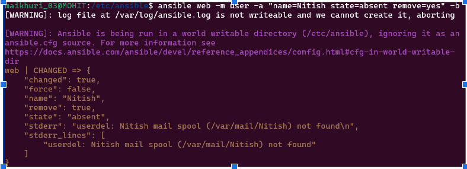
# Delete group
ansible web -m group -a "name=team1 state=absent" -b
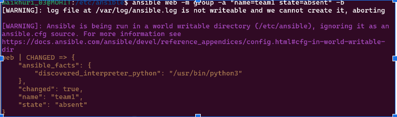
# List group 
ansible web -m command -a "cat /etc/group"
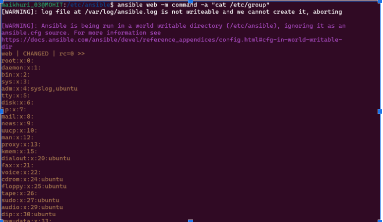
# List user 
ansible web -m shell -a "cat /etc/passwd"
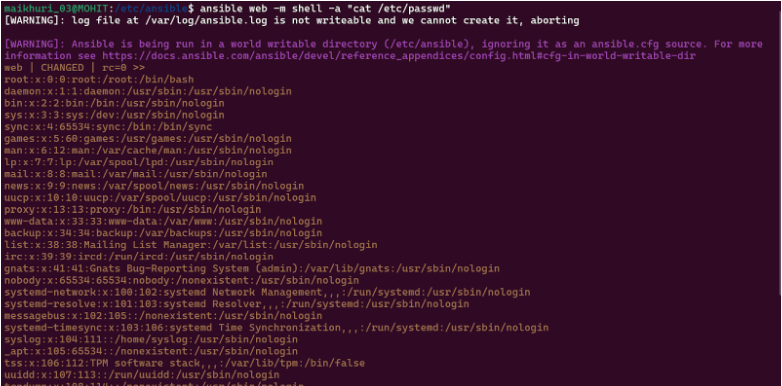

