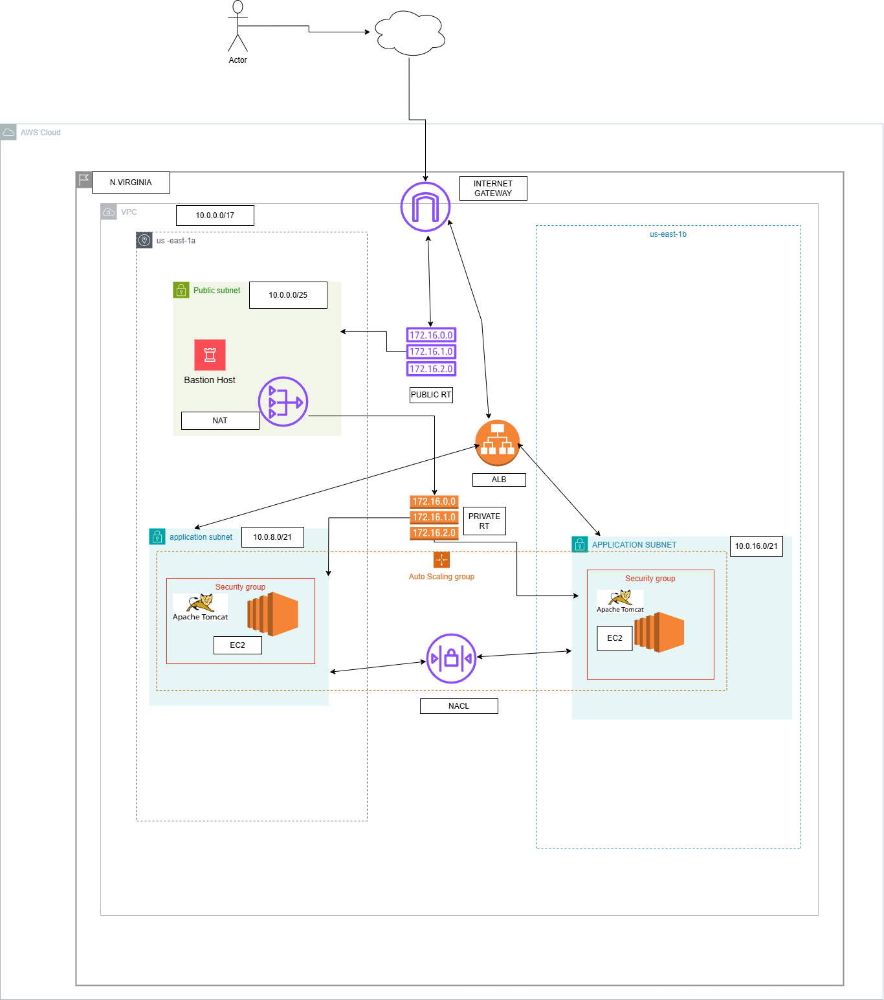
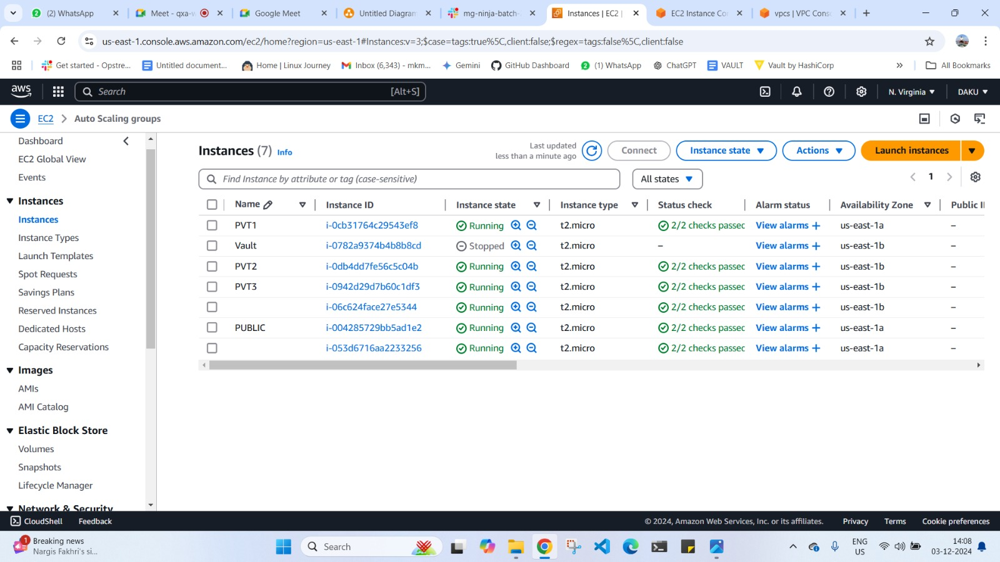

Assignment-01 (load Balancer & Auto Scaling Group)  

Objective:  

The goal of this assignment is to design and implement a cloud infrastructure that supports the deployment of a Spring 3 Hibernate application. The infrastructure will be designed for high availability, scalability, and security. The application will be deployed on private servers to ensure a secure environment.  

Spring 3 Hibernate Link-  

https://github.com/opstree/spring3hibernate.git 

Task Overview:  Infrastructure Design and Diagram Submission  

-  Design a comprehensive infrastructure diagram.  

-  The diagram should illustrate all key components, including networking, servers, load balancers, and auto-scaling groups.  

-  Submit the diagram for review.  

-  Final Implementation Code  

Note: After receiving feedback on the infrastructure diagram, proceed with the implementation.  

Hint:  

VPC: Network for all resources. 

Subnets: Public (LB) and Private (App Servers). 

LB: Distributes traffic to private subnets. 

ASG: Scales app servers based on demand. 

Security Groups: Manage traffic for LB and servers. 

NAT Gateway: Enables internet access for private subnets.

Implementation Steps
Note: These steps are a general guideline and may vary depending on the specific cloud platform used.

Create a VPC with public and private subnets.
Launch an internet gateway in the public subnet.
Create a route table associated with the VPC and a route to the internet gateway.
Configure a security group for the load balancer to allow inbound traffic on port 80 (HTTP) or 443 (HTTPS).
Launch the load balancer in the public subnet.
Create a target group to associate with the load balancer and specify the port for communication with the application servers.
Create a security group for the application servers to allow inbound traffic from the load balancer on the specified port.
Launch an Auto Scaling Group with the application server AMI (Amazon Machine Image).
Configure the Auto Scaling Group to launch instances in the private subnet and register them with the target group.
Configure scaling policies for the Auto Scaling Group to automatically scale based on CPU utilization or other metrics.
Deploy the Spring 3 Hibernate application on the application servers launched by the Auto Scaling Group.
