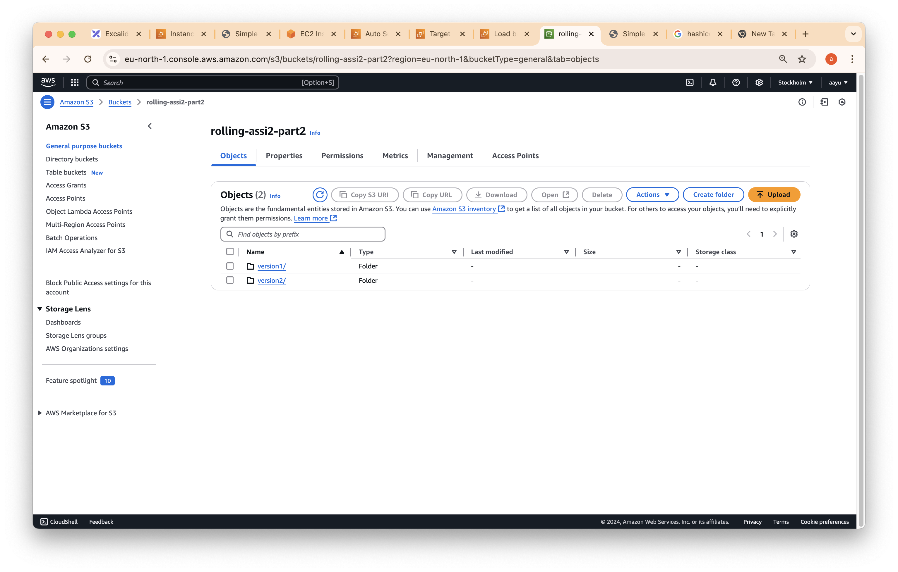

# Assignment 02 

Learn about various deployment strategies and implement them while integrating Amazon S3 for asset management and deployment artifacts. 

*   Deployment Strategies to Explore: 
*   Recreate Deployment 
*   Rolling Deployment 
*   Blue-Green Deployment 
*   A/B Deployment 
*   Canary Deployment 

Task Breakdown: 

Research and Understand Deployment Strategies: 
Write a brief description (100-200 words) for each of the five deployment strategies listed above. Include their advantages and disadvantages. 

Implementation: 
Must Do: 

Recreate Deployment: 
Manually deploy an application using an EC2 instance. 
Use an AMI snapshot for the application. 
Store static assets (e.g., images, CSS, JavaScript) in an Amazon S3 bucket and configure your application to retrieve these assets from S3. 

Rolling Deployment: 
Set up an Auto Scaling Group (ASG) with a minimum and maximum number of instances. 
Deploy the initial version of the application. 
Create a new launch configuration with the updated application version and update the ASG. 
Store deployment artifacts in an S3 bucket for easy retrieval 

Good To Do: 

Blue-Green Deployment: 
Create two identical environments (blue and green) using EC2 instances. 
Deploy the new version of the application to the inactive environment (green). 
Use a Load Balancer to switch traffic between the environments. 
Store configuration files or environment-specific assets in S3. 

Canary Deployment: 
Deploy the new version of the application to a small subset of instances in the ASG. 
Monitor performance and user feedback. 
Use S3 to store logs or metrics from the canary deployment. 

Documentation: 
Document each step of your implementation process,including any challenges faced and how you resolved them. 
Include screenshots or code snippets where applicable. 

GitHub Repository: 
Create a GitHub repository to store your research, implementation code, and documentation. 
Ensure your repository is well-organized with clear README files explaining each deployment strategy and how you implemented them. 

- [Implementation](#Implementation)

## PART-1 SERVER, IMAGE AND SNAPSHOT

#### Server Base

* nginx-v1
* AMI nginx-v1
* AMI Snapshot

#### Server Base

* nginx-v2
* AMI nginx-v2
* AMI Snapshot

## PART -2 Application Load Balancer

#### Auto-Scaling Group
* nginx v1 Removal - Deleted via Auto Scaling group
* nginx v2 Addition Template - Adding Via Auto Scaling

## PART -3 Application Load Balancer

#### Deployment Strategy

1. Recreate Strategy :- a basic deployment pattern which simply shuts down
    all the old pods and replaces them with new ones
* We don’t use it much as the downtime is high in this.

* Removed all Instance associated with v1 at one time

* We face downtime as every version deletes and it will time to make new version

2. Rolling Development Strategy :- A rolling deployment is a deployment strategy that slowly replaces previous versions of an application with new versions of an application by completely replacing the infrastructure on which the application is running.
* Deregister nginx v2 AMI associated instance 1-by -1
* Added nginx v2 and New-nginx-v2

*  Launch Instance nginx - We had launched one main ubuntu AMI then using that AMI we launch AMI nginx as base server, now we will launch nginx v1 and nginx v2 using base server

* Target Group

* Load Balancer

* Auto-Scaling Group

#### Add new version 

update template and add version 2 after that Start instance refresh 
Instance refresh performs a rolling update, replacing all or some instance

changing in Target group 

* we remove version line by line so we don’t face downtime

* Store deployment artifacts in an S3 bucket for easy retrieval 

