# Assignment 3 

"""Suppose your client has infrastructure running over the AWS cloud, but for the past few days, the client application has not been able to handle enough traffic and load, so he is thinking of setting up any reverse proxy for handling the load as middleware. He called you from the DevOps team and explained the problem statement. You have explained very well about the plan and design that you are going to perform."""  

You were told that nginx needs to be set up in between your client and application service, which can handle the request, but we need to setup one more thing, which is the basic HA (high availability) and DR (disaster recovery) of that middleware setup. Tasks would be done day-wise. 

## Day 1:  

- Create instance and install nginx on that, after that create an AMI-1 
- Create instance from the above AMI-1 and make V1 
- Do some changes in same instance and  again create AMI-2  
- Create instance from the above AMI-2 and make V2 
- Make both V1 and V2 AMI's  
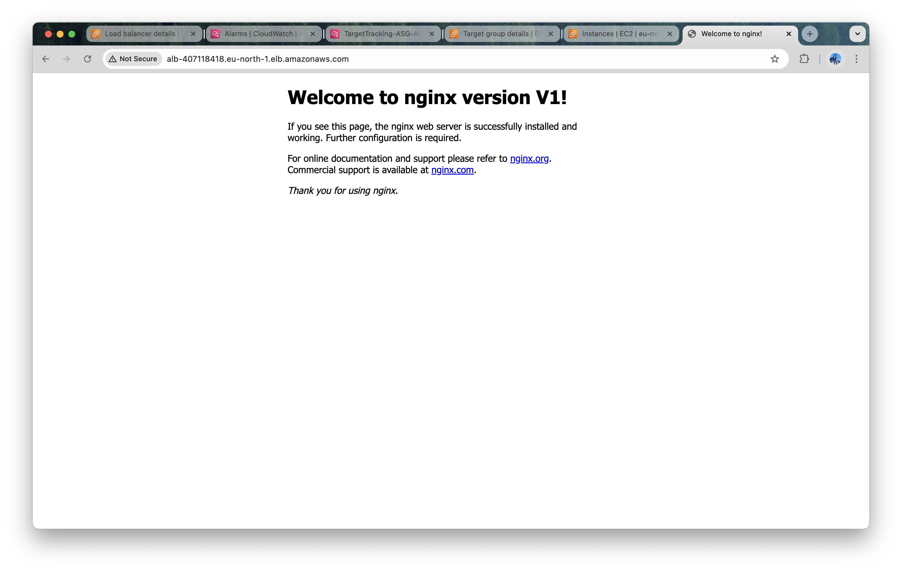
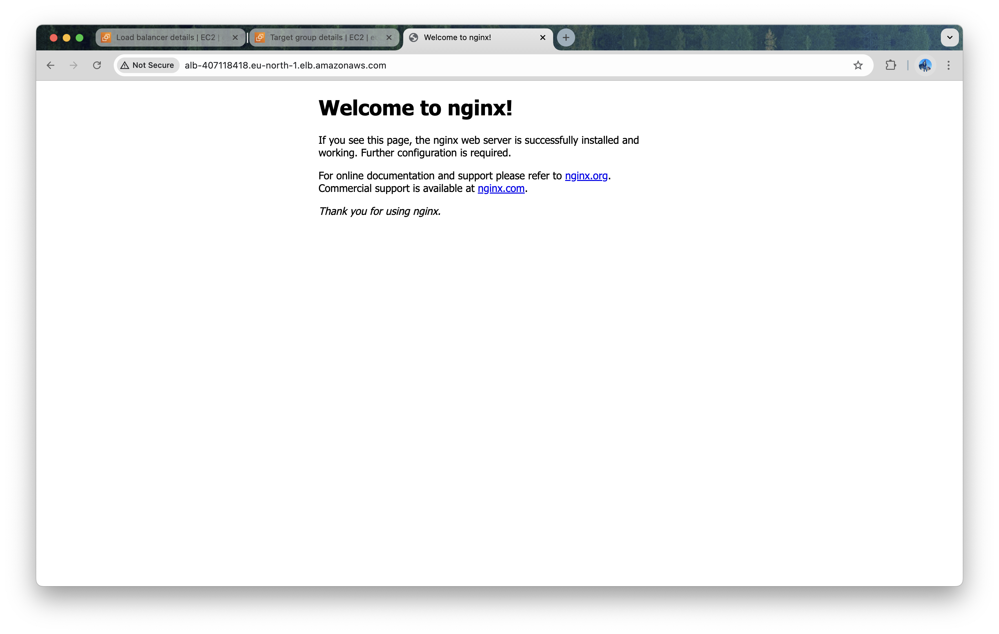

- Now you have 2 AMI's total  
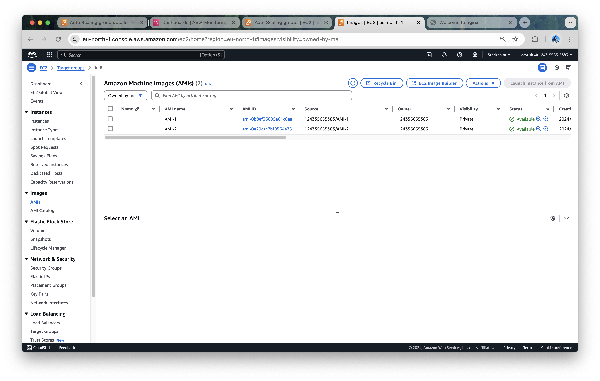

- Lunch Template

You have to continue the strategy with autoscaling group, attach asg on LB and follow the same strategy and make this highly available by testing load test on the nginx server so that it would autoscale at the time of load. 

Attach the policy to ASG and increase the stress according to policy mentioned then analyze the result. ( Try every policy ) 

* Avg CPU utilization 
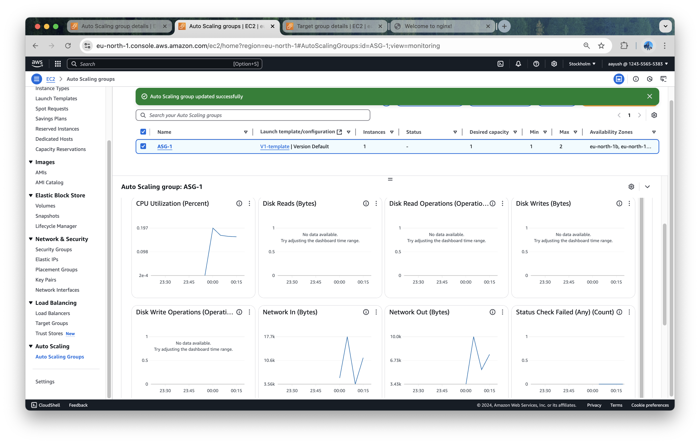

* Network bytes in/out 
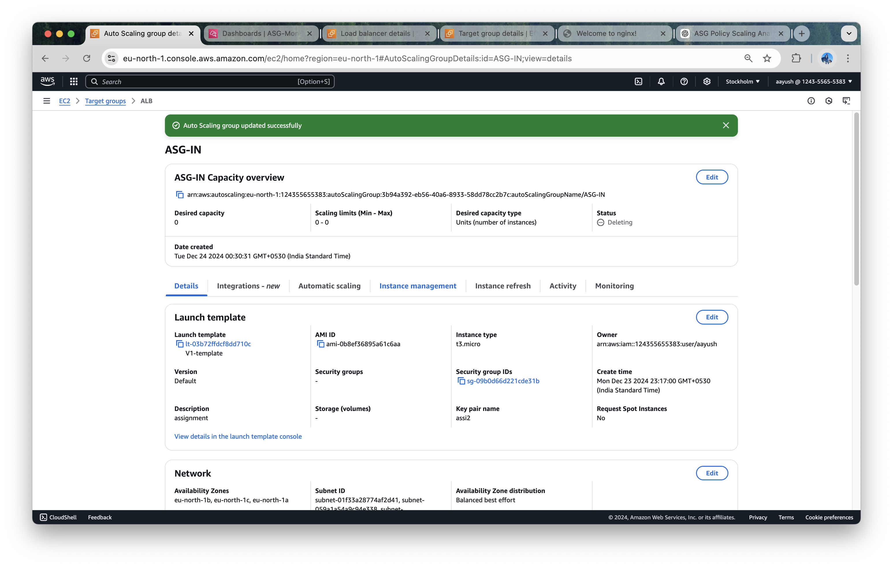
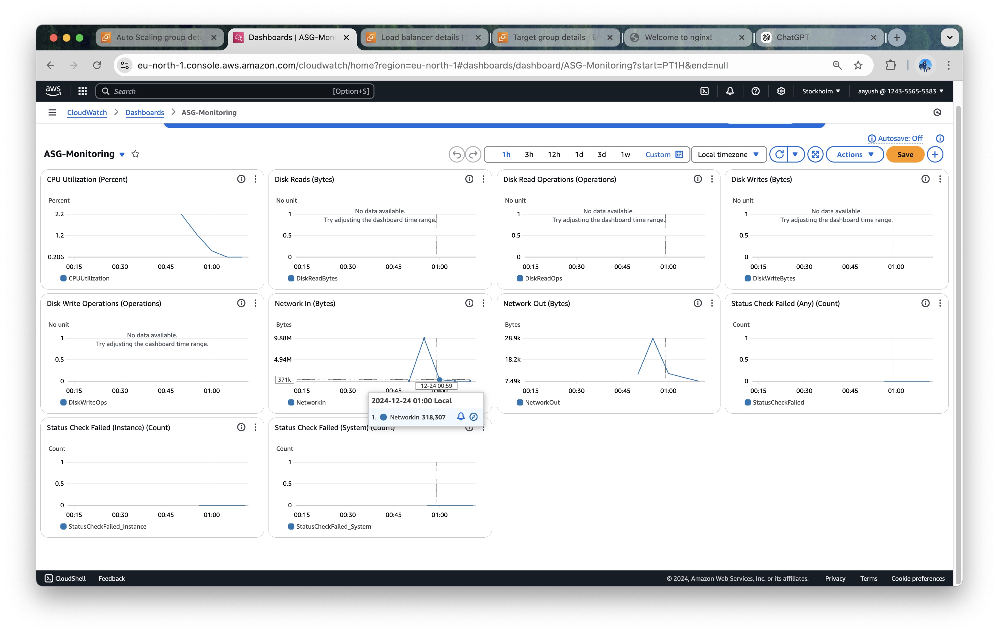

* ALB requests count per target. 

Somehow client needs version upgrade in Nginx so please upgrade V1 to V2 that you have made 
"""But the client has complained to us that our new version V2 is not compatible with the service, so please revert back. You need to revert back to the previous version. """ 

## Day 2: 
"""Client has told you about the change in it's Nginx as he needs this tool as hosting webpage too, so you need to plan accordingly. Also, he has specially mentioned that all tasks should be performed from their AWS environment, which means all O/P would be done through EC2 only. """ 

- You need to pull image content which would be display at the time of webpage hosting from VCS git and push your images on S3 bucket using aws-cli. **(Do not use secrete and access keys)** -----> **use IAM Role**

- You need to create a frontend including images in nginx page which will be fetched directly from S3 bucket. 
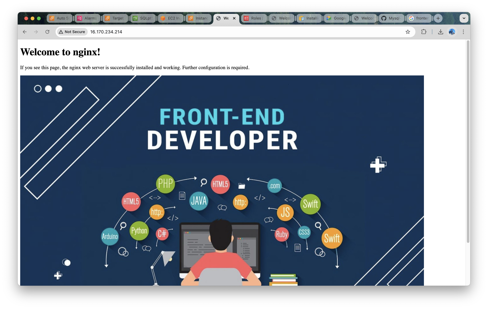

#### Commands
- git clone https://github.com/aayushverma19/image.git
- ls
- cd image/
- aws s3 ls
- aws s3 cp frontpage.jpeg bucket-assignment3-aws
- aws s3 cp frontpage.jpeg s3://bucket-assignment3-aws
- sudo vi /var/www/html/index.html 
- aws s3api put-object-acl --bucket bucket-assignment3-aws --key frontpage.jpeg --acl public-read

## Day3: 
"""Now client has again told us to test it continuously to see if ASG is working or not if my server got unhealthy."""  
Enter in the server and make some changes in server in order to make server unhealthy. Now analyze the result to see how ASG can help you to maintain your instance desire state. 

========================================== 

(Remember the special points from client) 
NOTE 1: You need to create the utility in such a way that it will make AMI of specific version and attach to the asg and perform the rolling deployment strategie. In case of revert back you should also have the function of revert back feature.  
NOTE 2: But always remember first do it all the tasks manually. 

========================================== 

GOOD TO DO: 
Do the whole automation with Blue Green Deployment and add CloudFront in front of Load Balancer to access the website in order to overcome latency. 
Continue to the previous assignment 1 and use your both nginx AMI's for displaying webpage and use your images from S3 bucket. 
 
## Day4: 

"""Client called devOps and asked if it was possible to get the two different details with single LB DNS, as he has two webpages and wants to pass the traffic through a single ALB but with a different path, like app.opstree.com/path1 or app.opstree.com/path2. """  
You have told him yes, it is possible with path-based routing in the ALB. Now do the following: 

* VPC

 Use existing Nginx and there should be 1 ec2 in each private subnet . 
    - 1 bastion host in public subnet . 
    - port 22 of bastion host should only accessible from your public ip. 
    - nginx welcome page with path '/ninja1' on first ec2 should display `Image-1`. 
    - nginx welcome page with path '/ninja2' on second ec2 should display `Image-2`. 
    - port 22 of  both the nginx servers should only be accessible from  bastion host. 

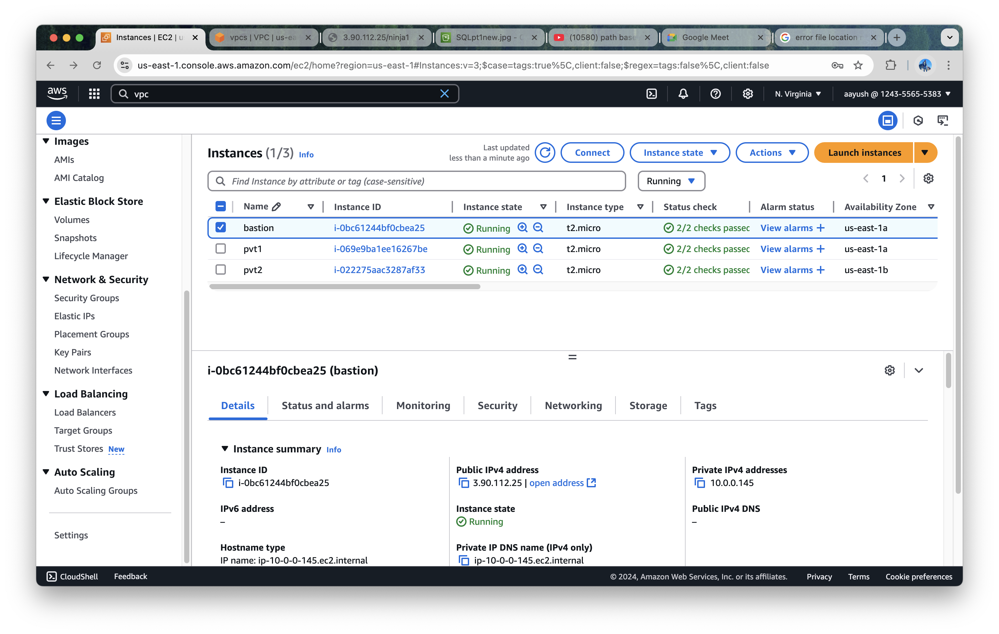

* nginx welcome page with path '/ninja1

* nginx welcome page with path '/ninja2
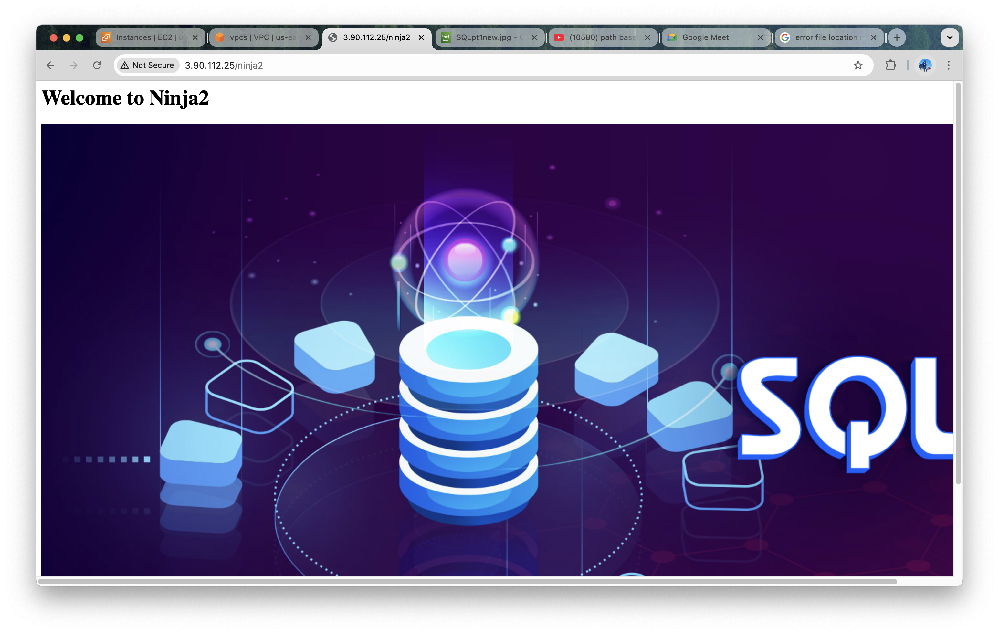

 Create target group for each nginx server. (2 servers) 
 Create Application load balancer. 
    - port 80 open of nginx server should only be accessible from your ALB. 
    - port 80 open of ALB should only be accessible from your public IP. 
    - ALB should only be accessible though your public IP none else. 
    - create listener rule so that {YOUR-ALB-DNS-NAME}/ninja1 should display welcome page of first ec2. 
    - create listener rule so that {YOUR-ALB-DNS-NAME}/ninja2 should display welcome page of second ec2. 
 Push all the updated images of the webpage to S3 bucket defined folders through any EC2 instance and maintain repo on that server only. 

* ALB

* Target Groups
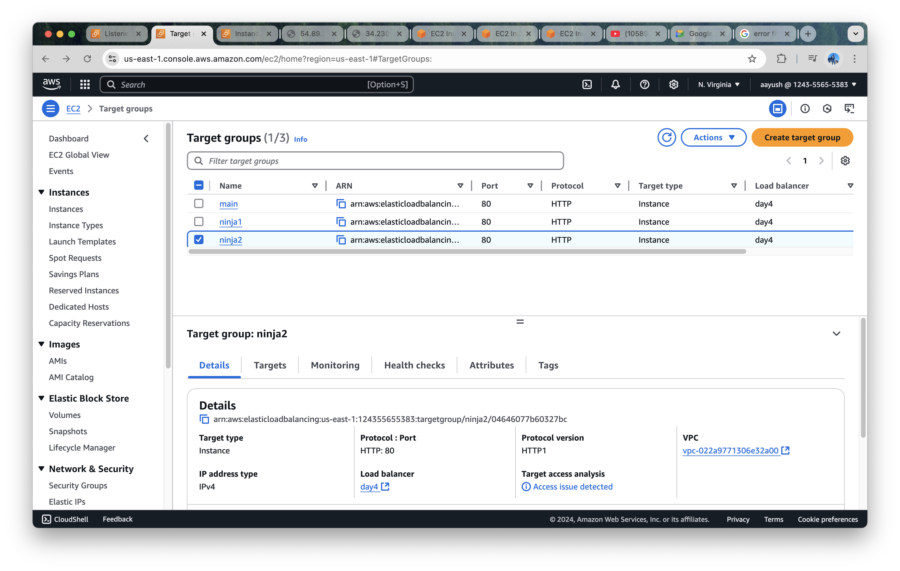

* {YOUR-ALB-DNS-NAME}/ninja1
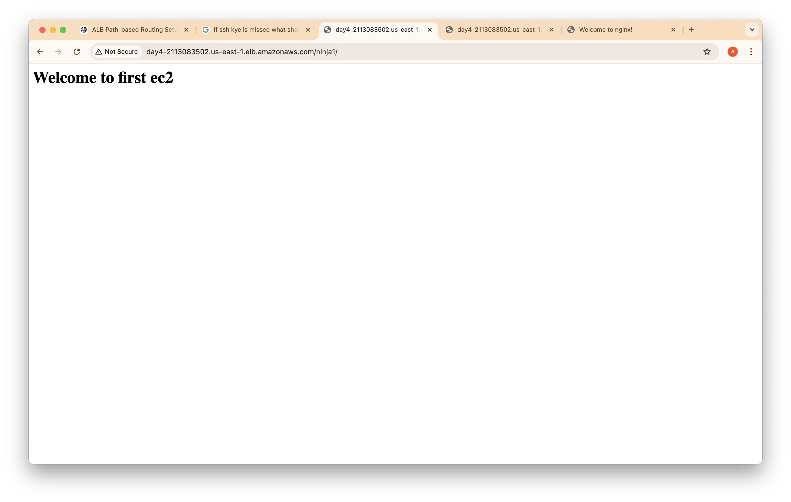

* {YOUR-ALB-DNS-NAME}/ninja2
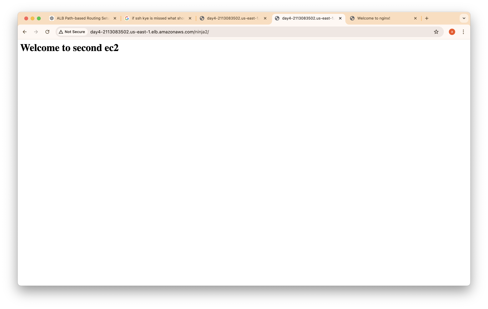

## Day5:  
"""Client asked for S3 service and bucket to be deployed in the US-East-1 region and segregate the folders with env names with proper restrictions.""" 
 You need to create a IAM user and a S3 Bucket on any of the region, Kindly follow as mentioned below : 

 - Create 2 folders prod and nonprod inside that bucket. 
 - Upload any different image files inside both folders. 
 - Create a role for the above specific task and it should only be access S3 full access 
 - A bucket should only be accessible from your both root, IAM user and nginx application. 
 - Restrict the access of IAM user to not access prod folder but able to access the nonprod folder. 
 - Set IAM and bucket policies in such a way that it accomplished the above points. 

## Day6: 
"""Client facing issue with some policy in IAM. Earlier,  he assigned one policy to S3, but if he assigned the same to CDN, then it showed an error. He called the devOps for this anonymous issue."""  
DevOps told him that it needs to be validated through a trust relationship in the IAM service 
 suppose organization wants to get the page access quick, so you need to implement CDN and fetch the images through CDN instead S3, use same role in the CDN which you are using in EC2 without any modification of policy. 
Make your own IAM user and assign minimal permissions to yourself for this task.

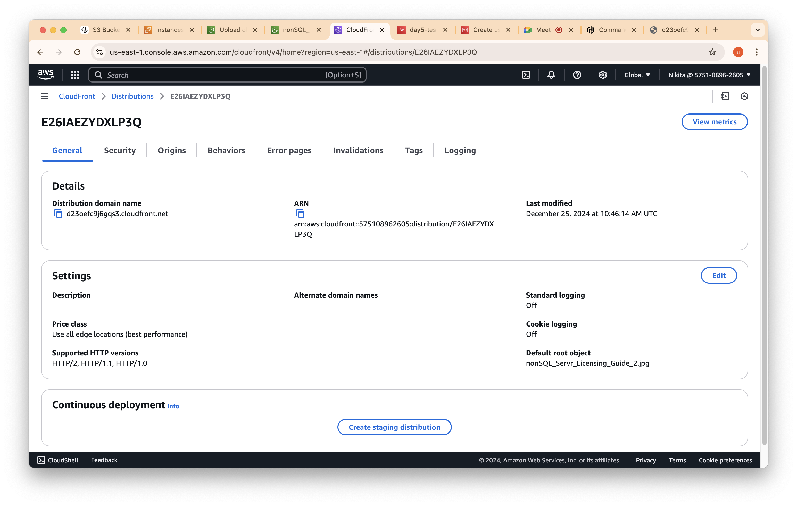
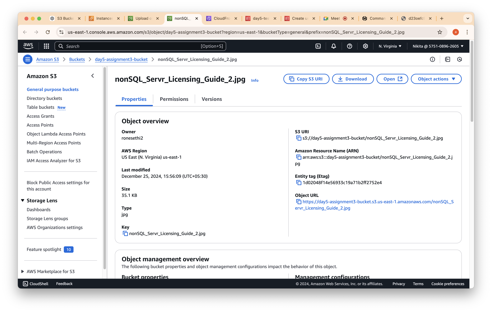